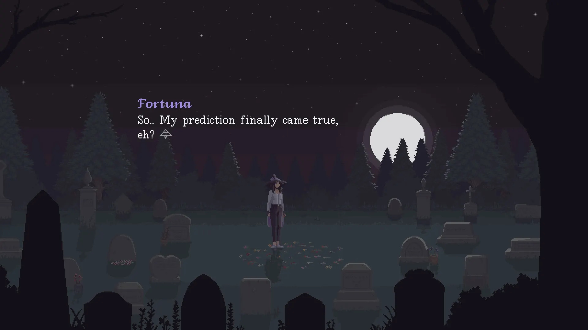

Emitido en el programa [**_11x24 | Miramos los perros y el futuro_**](https://go.ivoox.com/rf/127768806) de [**Refugio 101**](../../portfolio/refugio101).

> **_“There will always be things in life that escape our control. We cannot fight them all. But we can mourn, remember, learn, share, and accept.”_**

Si algo he aprendido de todo lo que he hecho hasta ahora, es que es mejor dejarse llevar por lo que te viene de sopetón, en vez de intentar planificarlo todo. Y sí, lo dice la misma persona que le pone una pistola en la cabeza a sus compañeros para que mantengan el excel de organización del programa al día.

A lo que quiero llegar es que originalmente esta semana iba a hablaros de otra cosa, algo que llevo preparando un tiempo porque tenía ganas de utilizar la radio como canal de propaganda. Pero recientemente he tenido un momento de lucidez y he visto de qué quería hablar realmente, como si lo leyera en el tejido del universo.

### Introducción

La principal inspiración de esta sección es _The Cosmic Wheel Sisterhood_, por Deconstructeam.
Y, por alusión directa, os recomiendo el segundo programa de la temporada dos de [_Sala Arcade_](https://freetoplaylab.com/temporada-2/), sobre el mismo juego.
De hecho, fueron Jordi y Alberto los que consiguieron, con su programa, que quisiera continuar con el juego, que tenía aparcado desde hace meses.

### Los dilemas que se nos presentan

Algo muy interesante que nos ofrece la ficción es la posibilidad de presenciar dilemas morales a los que nunca nos enfrentaríamos o ver situaciones desde puntos de vista completamente distintos a los que acostumbramos. Tenemos la suerte de ser ajenos a la diégesis y, por ende, no vemos repercusión real de lo que ocurre en esta en nuestro día a día. En el caso de las artes, por así decirlo “clásicas”, ni siquiera podemos ser partícipes de esa diégesis, somos meros espectadores de lo que ocurre, y estamos a la merced de lo que el autor decida.

Por eso los medios interactivos, y especialmente los videojuegos, presentan una oportunidad tan interesante. Como jugador, uno es espectador, pero también puede ser actor. Lo que se nos permita intervenir obra y obra varía, y en eso me quiero centrar. Quiero hablaros de esas obras en las que la autoría del jugador, dentro de una partida concreta, es no solo clara, sino clave para el desarrollo de la narración.

_Disco Elysium_ y _The Cosmic Wheel Sisterhood_ son dos ejemplos clarísimos de esto, pero muy distintos. Aviso ya que esta sección contiene espóileres muy menores del primero, y mayores del segundo. De hecho, voy a destriparos uno de los giros de guion más importantes del juego (si no el que más). Podría hablar de Baldur’s Gate III, pero como que no lo he jugado, y ya se ha hablado bastante de él en el programa, me abstendré de hacerlo.

### Disco Elysium: azar y elección

Empecemos por el primero. [_Disco Elysium_](https://discoelysium.com/), desarrollado por ZA/UM y publicado en 2021, es un juego de rol que bebe inmensamente del rol de mesa. El azar en este juego se introduce mediante tiradas de distintas dificultades con dos dados estándar de seis caras. El jugador puede decidir qué habilidades de su investigador mejorar a lo largo del juego para tener pequeños bonus, así cómo con qué ropa vestirlo, o en qué hacerle pensar.

En esta narración descubrimos el mundo con opciones de diálogo, muchas veces pudiendo volver a repetirnos y probar nuevos caminos. Las decisiones clave, además, no residen en elecciones per se, si no en cuándo es el momento adecuado para jugárnosla y dejar que los dados decidan por nosotros. Construimos la narración con su ayuda; o a pesar de su intervención, depende de cómo se quiera ver.

No es que las decisiones del jugador no tengan repercusión alguna en el juego; de hecho, es más bien al contrario. He escuchado anécdotas de mis amigos que no tienen que ver en absoluto con lo que yo he descubierto, por el simple hecho de tener un personaje más listo o más pasional. Y esto es algo chulísimo. Que cómo sea un personaje se vea realmente reflejado en todo lo que pasa en su entorno es algo que desgraciadamente no se da tanto como nos gustaría a algunos.

En muchos juegos se nos dice que nuestras decisiones tienen consecuencias y, aunque es cierto, no me parece que lleguen a este nivel. Que un personaje muera o no al final de tu juego es muy distinto a que la experiencia de juego sea distinta entre jugadores y partidas.

No obstante, aunque _Disco Elysium_ lleva de una forma increíble los árboles de decisiones y las posibilidades que ofrece son inmensas, hay algo con lo que se queda corto: las consecuencias. Haberlas las hay, vamos que si las hay. Mi problema no es que no existan, sino que no se sienten reales; o, al menos, no responsabilidad mía. No directamente. Es verdad, no debí tirar los dados, pero al final fueron ellos los que me hicieron fallar.

### The Cosmic Wheel Sisterhood: responsabilidad

Por otra parte, en [_The Cosmic Wheel Sisterhood_](https://www.cosmicwheelsisterhood.com) pasa al revés. Deconstructeam han pasado 5 años creando esta obra hasta perfilarla en el más mínimo detalle. Nada más tomar el papel de Fortuna, una bruja que ve el futuro a través de su baraja de tarot, se nos avisa de que las decisiones que tomemos tendrán consecuencias claras. Lo vemos venir. Y, de hecho, aquellas que son a corto plazo las vemos rápido. Pero no quiero hablar de si tal vez no debería haber tratado mal a cierto personaje. Quiero tratar el final.

Después de la muerte de la actual líder, Fortuna descubre que realmente fue desterrada y privada del acceso al Tarot, no por predecir la caída de su aquelarre, sino por escribirla. Aedana, la ahora fallecida líder, sabía que el talento de Fortuna no es leer el futuro, sino escribirlo. Y aquí nos damos cuenta de algo: todas las adivinaciones que hemos hecho no han sido adivinaciones. Hemos cambiado el curso de la realidad, futuro y pasado.

Esto significa que, genuinamente, todas nuestras decisiones han tenido consecuencias. Fortuna pasa por una crisis al descubrir que fue ella misma la que ha traído las desgracias a su entorno, hayan pasado ya o no. Todas las decisiones que le hemos visto o hecho tomar han pasado por ello. Aquí nos vemos como jugadores cara a cara con las consecuencias directas de nuestras acciones.

Vivimos de primera mano la culpabilidad, pues estas acciones, por mucho que sean dentro de una realidad ludo ficcional, son cosa nuestra. Nuestras decisiones han traído al aquelarre y a sus miembros donde están. No digo que tuviéramos libertad absoluta, las cartas que hemos creado tienen limitaciones, y la aleatoriedad de estas nos pone barreras. Y, obviamente, toda variabilidad está preparada por los desarrolladores. Pero el hecho de que las cosas salgan bien o (como en mi caso) mal, eso es cosa de las elecciones que hemos hecho.

En el final que yo conseguí, Fortuna termina odiando a Ábramar porque resolviera el pacto, y se siente completamente responsable por ello. Yo, como jugadora, me sentí también así. Entiendo por qué cumplir el pacto era lo que tenía que hacer, yo lo firmé, pero eso no le quita peso al asunto. Recuerdo leer de una carta “Nada es tu culpa, pero todo es tu responsabilidad”, y así es.

Mi final definitivo terminó con la lectura de una carta de la siguiente forma: “Siempre habrá cosas en la vida que se escapen a nuestro control. No podemos luchar contra ellas. Pero podemos lamentar, recordar, aprender, compartir, y aceptar.

Hay otros finales más bonitos, utópicos o no, pero no me terminan de gustar. Este concreto hizo que me planteara no solo que no todo puede tener un final bonito, sino que además mis decisiones realmente tuvieron una consecuencia. _The Cosmic Wheel Sisterhood_ ha conseguido que sienta la culpa y pena de la protagonista como mías, y que genuinamente vea que las decisiones tienen consecuencias.

> **_Pay the price._**

