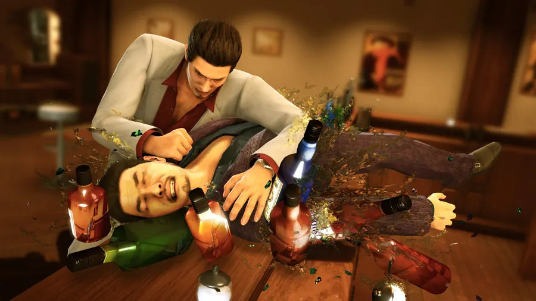

Emitido en el programa [**_11x15 | El aquello emocional_**](https://go.ivoox.com/rf/123240178) de [**Refugio 101**](../../portfolio/es/Refugio101.md).

El mito de que los videojuegos crean violencia y son solamente eso, ventanas a un ciclo perpetuo de sangre, disparos, muerte y vísceras lleva desde prácticamente el inicio de los videojuegos como medio de masas.
Pero esta no era la primera vez que pasaba.

Si vamos atrás hasta los años 50, cuando el sector del cómic se había asentado lo suficiente como para poder experimentar, podemos ver que pasó algo similar.
La prensa, los padres, y los políticos los consideraban un problema por transformar las mentes de sus angelitos en máquinas de matar.
Aunque claro, no había internet, y la televisión no estaba establecida como recientemente, así que no se dio tanto ni de la misma forma que con los videojuegos.

En 1992, en el pico de la batalla de consolas entre SEGA y Nintendo, salió al mercado _Mortal Kombat_.
Criticado por la violencia de su versión de arcade (caracterizada por sus _Fatalities_), las dos compañías tomaron rumbos opuestos para sus versiones de consola. SEGA mantuvo la violencia de la versión original, mientras que Nintendo porteó una versión censurada, más amigable con públicos y ojos jóvenes. Supongo que no os sorprenderá saber que la versión de SEGA vendió infinitamente mejor.

Los dos años consecutivos a este, en 1993 y 1994, se dieron en el congreso estadounidense las primeras comparecencias de compañías, desarrolladores y distribuidores por las acusaciones de violencia, y se demandó la regularización de un sistema de calificación para la industria.
Para la intervención de 1994, la ESBR (Entertainment Software Rating Board) acababa de ser fundada.
PEGI (Pan European Game Information), por si os interesa, se fundó en 2003.

Los tiroteos que se dieron en los años posteriores a este y juegos similares fueron directamente achacados a la violencia en videojuegos.
Al fin y al cabo, los dos jóvenes que hicieron la masacre del instituto Columbine en 1999 jugaban al _Doom_.
¿Qué más pruebas necesitamos?
Ah espera, que se trata de un país donde es más fácil comprar armas que un huevo Kinder.

En fin, los videojuegos no provocan tiroteos.
Podría estar horas citando estudios psicológicos que demuestran que hay más factores, y que se cae en la falacia de la falsa causa-efecto.
Pero eso, podría.

Algo que sí que es cierto es que la mayoría de la población gamer masculina tiende a ser violenta.
No porque jueguen a videojuegos, sino por cómo funciona nuestra sociedad de mierda.
La masculinidad tóxica inherente al patriarcado ha llevado a que la única forma “válida” (y digo esto entre infinitas comillas) de expresar los sentimientos de uno cuando es un hombre es mediante ira desmesurada y actos físicos de violencia.

Es por esto que no nos sorprenden los vídeos de jugadores destrozando ordenadores, pantallas o teclados, o conocer la infinidad que amenazas que existen en los chats de juegos online.
Sabemos que pasa, es parte de todo.
Pero, ¿tiene que serlo?

Obviamente, no todos los hombres que juegan a videojuegos son así.
Y todos podemos tener un mal día en el que morirnos en un videojuego nos toque las narices más que de normal, pero todo tiene un límite.

Ahora vengo a hablar “del lado contrario”.
Las mujeres y la violencia en videojuegos.
En los últimos años, hemos visto como un fenómeno que muchas acuñan como “female rage” ha llegado al mainstream para quedarse.
Recordemos que el patriarcado nos afecta a todes.
Mientras que a los hombres los limita a prácticamente solamente expresarse mediante la ira, las mujeres deben evitarla a toda costa si no quieren ser tachadas de “locas” o “neuróticas”.

La ira femenina tratada como algo normal no es algo que se vea mucho, al menos hasta estos últimos años.
Cada vez vemos más mujeres genuinamente enfadadas y siendo violentas, sin ser caricaturizadas como “locas” o “exageradas” por sentirse o comportase así.
Tal vez alguna loca sí que estaba, pero en el sentido literal de la palabra, y te estoy mirando a ti Pearl…

Pero “adquirir” el “derecho” a enfadarse no equivale a convertirse en lo que se juró destruir.
Que la ira sea una emoción más, no la única válida.
En vez de eso, intentemos que nuestros personajes masculinos sean más reales, y que nuestros amigos y compañeros se sientan cómodos de expresarse de otras formas y mostrar vulnerabilidad.

Y bueno, ahora vengo a traeros un ejemplo de juego violento para hombres que no ha acabado siendo eso.
Sí, vengo a hablar de mi libro
La saga _Yakuza_ (ahora comercializada en occidente como _Like a Dragon_) empezó como unos juegos creados única y exclusivamente para hombres.

El juego explora la fantasía de poder masculina, y busca claramente apelar al público masculino japonés con sus minijuegos un tanto, curiosos.
Con el tiempo, obviamente, se ha ido modernizando, y desde que diría incluso la tercera entrega ya podemos empezar a ver personajes muchísimo más humanos, aunque manteniendo la inmensa violencia de los dos primeros juegos, y su humor tan característico.

Pero algo curioso, es que en Japón tres de cada cuatro fans del juego son mujeres, principalmente chicas jóvenes.
Y no es solamente por el hecho de que haya señores guapos en la pantalla, una se cansa de eso eventualmente.
Recordemos cómo es Japón de reservado.
Las cabinas de destrozar cosas que hay en la capital nipona están siempre llenas de chicas jóvenes.
“Vienen en enjambres”, dicen algunos propietarios de estos locales.
Las mujeres de Japón están enfadadas, normal, y necesitan exteriorizarlo.

Es por esto que no me sorprende los números.
Y me parecen más que normales, sinceramente.
¿Qué mejor forma de liberar tensión que apalizar hombres por la calle?
Al fin y al cabo, sigue siendo fantasía de poder también para las chicas.
La cantidad de veces que yo he utilizado un _Yakuza_ para quitarme el estrés del cuerpo exteriorizando mi ira con NPCs de Sotenbori, Ryuyku y Kamurocho es tan grande que he perdido la cuenta.

