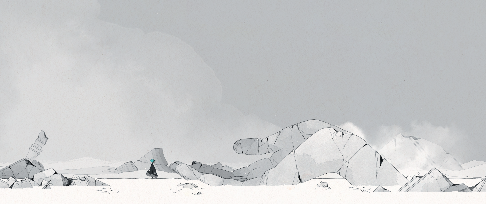
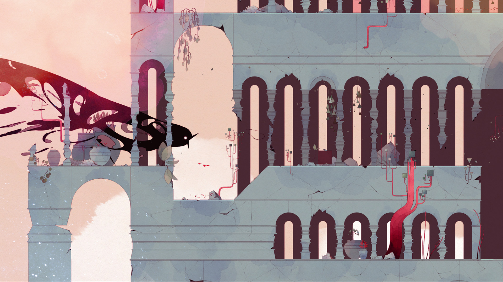
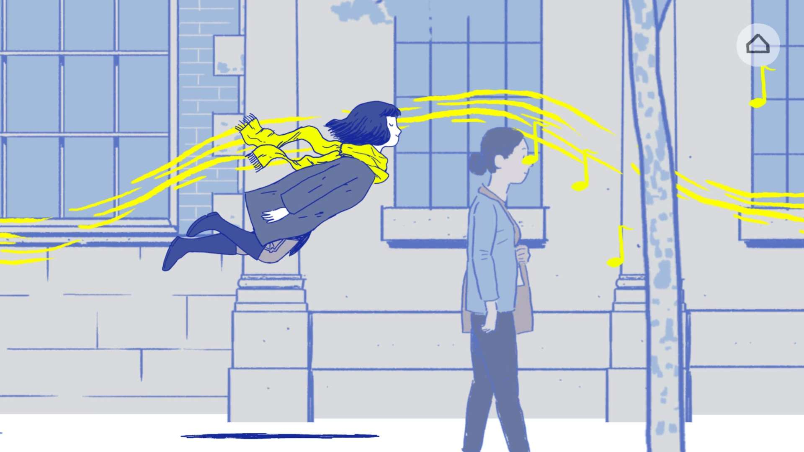
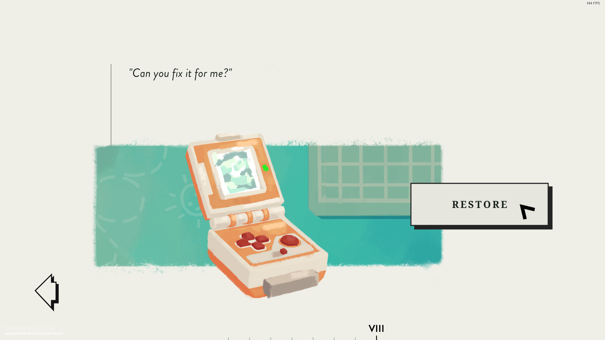
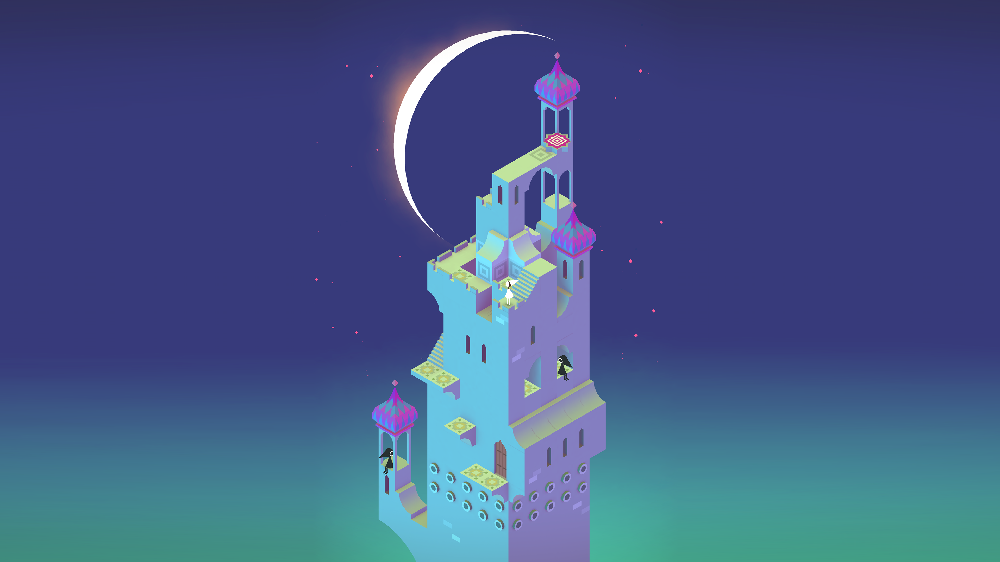

Emitido en el programa [**_11x19 | El puzzle de la pérdida_**](https://go.ivoox.com/rf/124780148) de [**Refugio 101**](../../portfolio/es/Refugio101.md).
Incluido en el programa [**_Nuevos Niveles #1_**](https://freetoplaylab.com/nuevos-niveles/) de [**Sala Arcade**](https://freetoplaylab.com/podcast/).

El duelo es un proceso largo y, mayoritariamente, costoso.
No es algo que se supere de un día para otro, ni es un paseo agradable.
Pero ser seres vivos implica que eventualmente morimos, igual que los seres vivos de nuestro entorno.
Eventualmente todos nos vamos. No pretendo incitar al nihilismo, pero pensar en esto suele hacerme más fácil el camino.

### Juegos sobre la pérdida y el camino que sigue

Desde que empecé la carrera, he jugado a muchos juegos indie.
Es sorprendente la cantidad de juegos que tratan, de una forma u otra, la pérdida o el cambio forzado de paradigma.
Pararme a pensar en ellos (así como jugarlos en su momento) me ha ayudado con mi duelo, y quiero hablar de ellos.

Primero quiero mencionar que he hecho mucha fuerza para no estar media hora hablando de los _Yakuza_ (especialmente del 0) para evitaros los espóileres, y para demostraros que sé hablar de más cosas.

#### GRIS

Si habéis pasado por narrativa, lleváis suficiente tiempo escuchando el Refugio 101, o lo habéis jugado, sabréis perfectamente de qué va _GRIS_.
[_GRIS_](https://nomada.studio/gris-game/), de Nómada Studio, ha sido el centro de conversaciones sobre el duelo desde que salió en 2018.
Y es que retrata perfectamente las fases del duelo a través de sus mecánicas y ambientación.

Cada uno lleva el duelo de forma distinta, y lo que para alguien cuesta de aceptar dos minutos, otros tardan años en comprender.
Además de que no es una historia lineal: volver atrás porque realmente no hemos superado una fase es completamente normal.
No voy a entrar en detalles porque todos lo tenemos bien conocido (y si no, juégalo).

#### Florence

[_Florence_](https://annapurnainteractive.com/en/games/florence), desarrollado por Mountains y sacado en 2018, relata la pérdida de una forma distinta.
En esta novela visual, también conocidísima y muy recomendada, seguimos a Florence Yeoh en su viaje para encontrarse a sí misma.
El juego trata desde cómo se encuentra a ella misma y retoma sus pasiones gracias a una relación nueva hasta la muerte de esta y el duelo que pasa después.

No obstante, la narración interpreta esto no solamente como una pérdida, sino como una oportunidad para crecer y volver a empezar.
El juego concluye con Florence habiendo aprendido de su relación y su vida antes de esta, y recupera sus ganas de vivir y perseguir su sueño.
El final de algo importante en nuestras vidas no es el final de todo.

#### Assemble With Care

En [_Assemble With Care_](https://ustwogames.co.uk/our-games/assemble-with-care/) (Ustwo Games, 2019), jugamos como María, una restauradora de antigüedades nómada.
Pero no me quiero centrar en ella, sino en la gente para la que arregla objetos.
María trata con el alcalde del pueblo que visita, que está superando la reciente pérdida de su mujer, y repara su caja de música.
También ayuda a su hija, a quien se le ha roto su Game Boy, y ayuda a ambos a mejorar su relación padre-hija.
En otra ocasión, ayuda a la propietaria de un café a arreglar distintos objetos para que el negocio de sus sueños siga adelante, y habla con ella sobre su relación escabrosa con su hermana mayor.

A lo largo del juego, María ayuda con sus palabras y su trabajo a la gente con la que se encuentra.
Todos han perdido algo de alguna forma, y me parece una forma muy bonita de enseñar cómo la gente crece y se enfrenta de distintas maneras a los giros de la vida.

#### Monument Valley

_Monument Valley_(https://ustwogames.co.uk/our-games/monument-valley/) también de Ustwo Games es uno de mis juegos favoritos y, aunque extremadamente obtusa y ligera, su historia me encanta.
A través de pequeñas conexiones descubrimos junto a Ida, la protagonista, quién es, qué hizo en el pasado, y cómo ha llegado a dónde está.
Es un relato sobre lo que viene después de la pérdida.

Cada vez que lo juego me afecta un poquito más esta historia, seguramente porque cada vez he pasado más tiempo viva.
Al fin y al cabo, aunque no sea tan exagerado como no saber qué ha pasado antes del ahora y de quién has sido hasta este momento, cada día nos movemos hacia adelante buscando quiénes somos y cuál es nuestro lugar.

### El duelo no desaparece, nosotros crecemos

Con estos cuatro juegos que tratan la pérdida de formas distintas, quería hablaros de lo que es para mí el duelo y qué me ha ayudado con él.
Me pasa mucho que, cuando algo cambia en mi entorno, me olvido de ello.
Ya sea que he cambiado de curso, una reforma en casa, o una amistad que ha terminado.
Siempre me pasa igual: necesito un tiempo de buffer para asimilarlo.
Y, aun así, aunque pase mucho tiempo, a veces mi memoria falla y me bloqueo porque he entrado a un baño que reformamos hace seis años, pero yo no me acordaba, o creo que llevo el pelo larguísimo a pesar de que me lo dejé corto al terminar bachillerato.
A veces pienso en enseñarle una foto de un sitio que visito a mi abuelo, a pesar de que hace tanto que pasó que no recuerdo ni en qué año lo enterraron.

Mis recuerdos de estas cosas, y sobre todo de estas personas, siguen conmigo.
Seguirán conmigo hasta que desarrolle alzhéimer o demencia, o hasta que me muera.
No les echo menos de menos, no es que ese hueco haya menguado.
Pero la niña que vio a sus padres llorar en el entierro ha crecido desde entonces.
Y la chica que ha visto a sus padres llorar al dejar el cuerpecito de su loro en el centro donde lo adoptaron también crecerá.

El duelo no se va, los recuerdos no desaparecen.
Nosotros crecemos alrededor del hueco que queda en nuestros corazones.
Soy cada persona y cosa que ha pasado por mi vida, y las llevaré conmigo hasta la tumba.
Y los juegos que me han acompañado y enseñado a crecer también son parte de mí.
